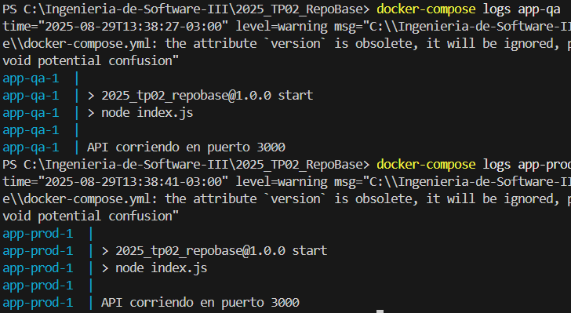

# mi-api-docker

## Descripción

API REST simple en Node.js con Express y base de datos PostgreSQL, preparada para ejecutarse en entornos QA y PROD usando Docker y Docker Compose.

---

## Requisitos

- Docker
- Docker Compose

---

## Construcción de las imágenes

```bash
docker-compose build
```

---

## Ejecución de los contenedores

```bash
docker-compose up
```

---

## Acceso a la aplicación

- **QA:** [http://localhost:3001/ping](http://localhost:3001/ping)
- **PROD:** [http://localhost:3002/ping](http://localhost:3002/ping)

Para ver los mensajes almacenados en la base de datos:
- **QA:** [http://localhost:3001/mensajes](http://localhost:3001/mensajes)
- **PROD:** [http://localhost:3002/mensajes](http://localhost:3002/mensajes)

---

## Conexión a la base de datos PostgreSQL

```bash
docker exec -it tp2-db-1 psql -U postgres  
```

Dentro de la consola de PostgreSQL, puedes crear la tabla y agregar datos:

```sql
CREATE TABLE tabla_a (mensaje VARCHAR(50));
INSERT INTO tabla_a VALUES ('Hola mundo!');
SELECT * FROM tabla_a;
```

---

## Verificación de persistencia de datos

1. Reinicia los contenedores:
   ```bash
   docker-compose down
   docker-compose up
   ```
2. Vuelve a consultar `/mensajes` y verifica que los datos siguen presentes.

---

## Acceso a los logs

Para ver los logs de la aplicación:
```bash
docker-compose logs app-qa
docker-compose logs app-prod
```

---

## Versiones de la imagen en Docker Hub

- Desarrollo: `sofiacontreras2003/2025_tp02_repobase:dev `
- Estable: `sofiacontreras2003/2025_tp02_repobase:v1.0`

---

## Problemas frecuentes

- Si la app no conecta a la base, espera unos segundos y vuelve a intentar.
- Si necesitas limpiar la base, elimina el volumen con:
  ```bash
  docker volume rm tp2-db-1
  ```

---

## Evidencia de funcionamiento

Incluye capturas de pantalla o logs mostrando:
- La app corriendo en QA y PROD.

- Conexión exitosa a la base de datos.

- Persistencia de datos entre reinicios.

---

## ¿Porque realizamos el TP asi?

## Justificación del enfoque del TP2

Realizamos el TP2 siguiendo buenas prácticas de desarrollo moderno, usando Docker para asegurar portabilidad y reproducibilidad.  
Elegimos una base de datos PostgreSQL porque es robusta y ampliamente utilizada en proyectos reales, permitiendo demostrar la persistencia de datos entre reinicios de contenedores.  
Utilizamos la imagen oficial `node:20` como base para la aplicación por su estabilidad y soporte, facilitando la ejecución en cualquier entorno.  
Publicamos la imagen en Docker Hub con diferentes tags (`dev` y `v1.0`) para mostrar cómo se gestionan versiones de desarrollo y producción, permitiendo despliegues consistentes y controlados en distintos entornos (QA y PROD) usando la misma imagen y y variables de entorno.

--- 

## Mejoras implementadas

- Bases de datos separadas para QA y PROD, permitiendo datos independientes en cada entorno.
- Endpoint POST `/mensajes` para agregar mensajes desde el frontend.
- Frontend básico en React para visualizar y agregar mensajes en QA y PROD.
- Script de inicialización para crear la tabla y datos iniciales automáticamente.
- Documentación ampliada y ejemplos de uso.

## Estrategia de versionado y publicación de imágenes

Para asegurar un desarrollo y despliegue controlado, publiqué dos versiones de la imagen de la aplicación en Docker Hub:

- **dev:** Imagen destinada a desarrollo y pruebas, donde se pueden realizar cambios y testear nuevas funcionalidades sin afectar la versión estable.
- **v1.0:** Imagen estable lista para producción, utilizada en entornos donde se requiere mayor confiabilidad.

Esto permite que los entornos QA y PROD usen la misma imagen base pero con diferentes configuraciones, y facilita el mantenimiento y la actualización de la aplicación.  
En el archivo `docker-compose.yml` se puede especificar qué versión de la imagen utilizar en cada entorno, cambiando el tag según sea necesario.

**Ejemplo de uso en docker-compose.yml:**
```yaml
app-qa:
  image: sofiacontreras2003/2025_tp02_repobase:dev
  ...
app-prod:
  image: sofiacontreras2003/2025_tp02_repobase:v1.0
  ...
```
De esta forma, se garantiza que cada entorno utilice la versión adecuada de la aplicación, facilitando el control de cambios y la estabilidad del sistema.


## Ejemplo de uso

1. Levanta los servicios:
   ```
   docker-compose up --build
   ```
2. Accede al frontend en [http://localhost:3000](http://localhost:3000)
3. Cambia entre QA y PROD, agrega mensajes y verifica que los datos son independientes.

---
