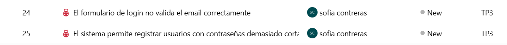
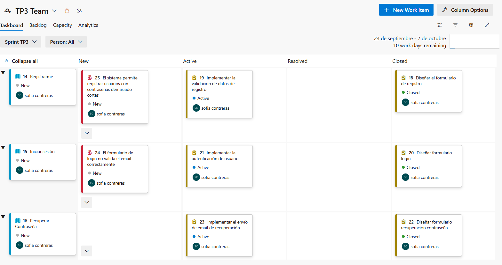
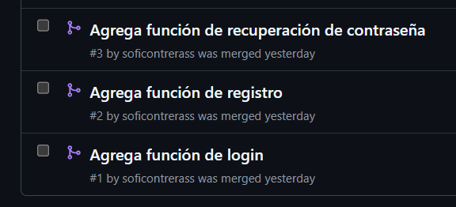
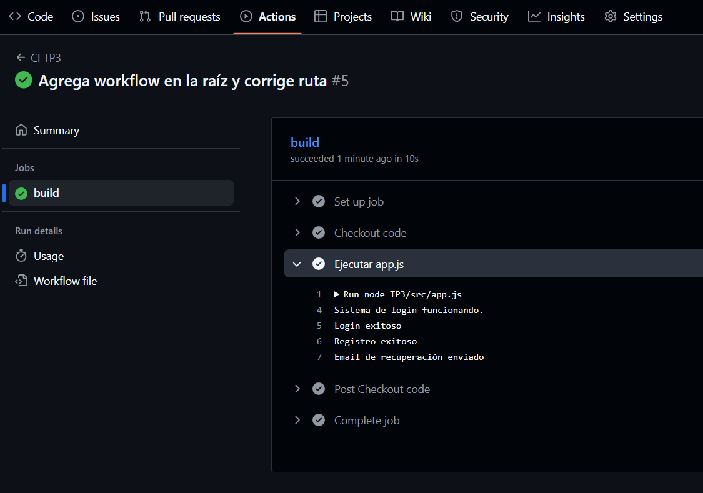
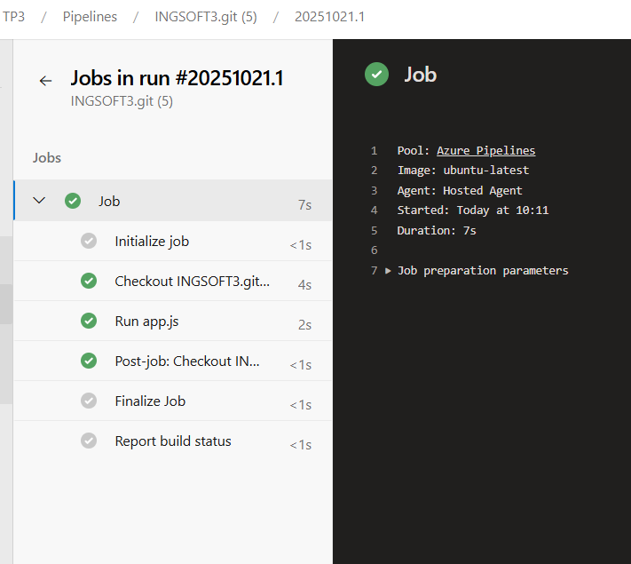

# Decisiones del TP3

## Metodología ágil elegida y justificación

Se eligió el proceso **Agile** de Azure DevOps por su flexibilidad y adaptación a equipos pequeños y proyectos académicos. Permite organizar el trabajo en ciclos cortos, priorizar tareas y gestionar cambios de manera eficiente, facilitando la colaboración y el seguimiento del avance.  
La gestión de trabajo se realizó en Azure Boards, mientras que el control de versiones y la automatización CI/CD se implementaron en GitHub, aprovechando lo mejor de ambas plataformas.

No configuré el equipo principal y las áreas del proyecto para centralizar la colaboración y asignación de tareas ya que voy a trabajar sola.

## Estructura de trabajo

- **Epics:** Agrupan funcionalidades principales y objetivos generales del proyecto.
- **User Stories:** Representan necesidades y requisitos funcionales desde la perspectiva del usuario.
- **Tasks:** Descomponen las User Stories en actividades técnicas concretas, facilitando la asignación y el control de progreso.
- **Bugs:** Permiten registrar y gestionar errores detectados durante el desarrollo y pruebas.

## Estructura de trabajo en Azure Boards

- **Epic:** Implementar sistema de login.
- **User Stories:** 
  - Iniciar sesión
  - Recuperar contraseña
  - Registrarme
- **Tasks:** 
  - Diseñar el formulario de registro
  - Implementar la validación de datos de registro
  - Diseñar formulario login
  - Implementar la autenticación de usuario
  - Diseñar formulario recuperación contraseña
  - Implementar el envío de email de recuperación
- **Bugs:** 
  - El formulario de login no valida el email correctamente
  - El sistema permite registrar usuarios con contraseñas demasiado cortas

Todos los work items están asignados al Sprint 1 (2 semanas) y relacionados según corresponda.  
Se adjuntan capturas de pantalla en `/evidencias` mostrando la organización y el avance.

---

## Evidencia de funcionamiento

- Board con work items organizados (ver capturas en `/evidencias`)

- Sprint con work items asignados

- Pull Requests aprobados y mergeados en GitHub

- Pipeline de GitHub Actions ejecutando el código automáticamente

- Pipeline de Azure ejecutando el código automáticamente

---

## Integración técnica y automatización

La gestión de trabajo se realizó en Azure DevOps, mientras que el control de versiones y la automatización de CI/CD se implementaron en GitHub usando GitHub Actions.  
Esto permite aprovechar lo mejor de ambas plataformas: organización ágil y automatización moderna.

- Se configuraron ramas de feature y Pull Requests protegidos por políticas de revisión.
- Se implementó un workflow de GitHub Actions para validar los builds y asegurar la calidad antes de cada merge.
- Todo el código y la evidencia están versionados y documentados en el repositorio.

---

## Integración CI/CD

Se configuró GitHub Actions para ejecutar el código automáticamente en cada cambio relevante.  
Esto asegura que el sistema funciona y permite detectar errores rápidamente antes de integrar nuevas funcionalidades.

---

## Problemas encontrados y soluciones aplicadas

- **Conflictos de merge en app.js:**  
  Al integrar las ramas de feature, surgieron conflictos en el archivo principal. Se resolvieron manualmente, manteniendo una sola versión de cada función y realizando el commit correspondiente.

- **Ruta incorrecta en el workflow de GitHub Actions:**  
  Inicialmente, el pipeline fallaba porque la ruta al archivo `app.js` era incorrecta. Se corrigió la ruta en el archivo `ci.yml` para que apunte a `TP3/src/app.js`.

- **Carpeta .github no visible en GitHub:**  
  El workflow no se ejecutaba porque la carpeta `.github/workflows` estaba dentro de una subcarpeta. Se movió a la raíz del repositorio y se realizó el commit y push nuevamente.

- **Sin cambios pendientes para subir:**  
  En ocasiones, el mensaje `nothing to commit, working tree clean` aparecía porque los cambios ya estaban subidos. Se verificó la ubicación y el estado de los archivos antes de continuar.

---
