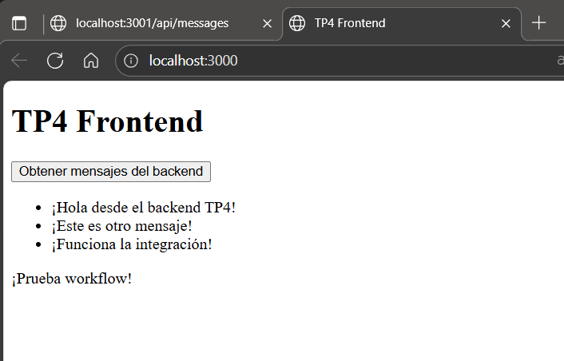
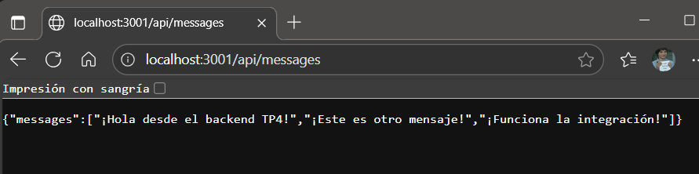
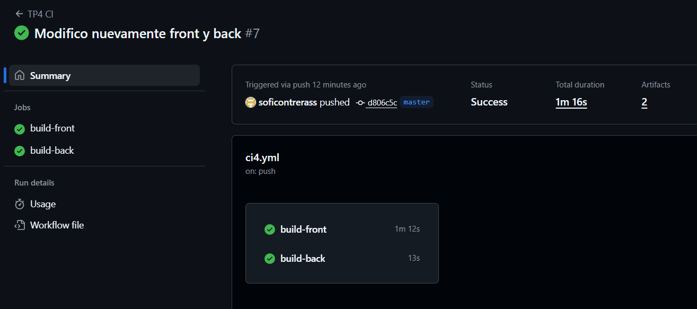

# Decisiones TP4

## Stack elegido

- **Frontend**: React
  - Popularidad y facilidad de uso
  - Ecosistema npm
- **Backend**: Node.js con Express
  - JavaScript en todo el stack
  - APIs REST simples

## Estructura del repo

- `TP4/front`: código frontend
- `TP4/back`: código backend
- `.github/workflows/ci4.yml`: workflow CI/CD

## Funcionalidad implementada

- El frontend consulta el backend mediante fetch al endpoint `/api/messages`.
- El backend responde con un array de mensajes en formato JSON.
- Los mensajes se muestran dinámicamente en la interfaz del frontend.

## Diseño del pipeline

- Dos jobs independientes: build-front y build-back
- build-front: instala dependencias y compila React
- build-back: instala dependencias y ejecuta tests
- Publica artefactos de ambos

## Artefactos

- **front-dist**: Archivos estáticos del frontend
- **back-dist**: Código backend listo para deploy

## Evidencias

- Captura de la página mostrando los mensajes obtenidos del backend.

- Captura del endpoint funcionando en el navegador.

- El pipeline corre correctamente en cada push/pull request.

- Los artefactos se pueden descargar desde la sección **Artifacts** en GitHub Actions.

## Consideraciones Adicionales

- **Uso de `.gitignore`**: Se agregó para evitar subir `node_modules` al repo.
- **Independencia de builds**: Los jobs de frontend y backend son independientes y corren en paralelo.
- **Corrección de rutas**: Se ajustaron los nombres de carpetas en el workflow para evitar errores de ejecución.

---