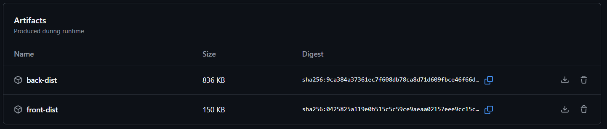

# Decisiones TP4

## Stack elegido

- **Frontend**: React
  - Popularidad y facilidad de uso
  - Ecosistema npm
- **Backend**: Node.js con Express
  - JavaScript en todo el stack
  - APIs REST simples

## Estructura del repo

- `TP4/frontend`: código frontend
- `TP4/backend`: código backend
- `TP4/evidencias`: evidencias del trabajo práctico
- `TP4/frontend/build`: archivos estáticos generados por React para producción
- `.github/workflows/ci4.yml`: workflow CI/CD

## Funcionalidad implementada

- El frontend consulta el backend mediante fetch al endpoint `/api/messages`.
- El backend responde con un array de mensajes en formato JSON.
- Los mensajes se muestran dinámicamente en la interfaz del frontend.

## Diseño del pipeline

- En este TP implementé el pipeline CI/CD usando GitHub Actions, que utiliza agentes hospedados por GitHub.
- Si el TP exigiera Azure DevOps y agente Self-Hosted, el proceso sería similar pero instalando y configurando el agente en mi máquina.
- Dos jobs independientes: build-front y build-back
- build-front: instala dependencias y compila React
- build-back: instala dependencias y ejecuta tests
- Publica artefactos de ambos

## Artefactos

- Los artefactos sirven para guardar y compartir los resultados de los procesos de build en el pipeline
- **front-dist**: Archivos estáticos del frontend generados en `TP4/frontend/build`. La carpteta build es el resultado del proceso de compilación del frontend y que se publica como artefacto. 
- **back-dist**: Código backend listo para deploy

## Evidencias

- Captura de la página mostrando los mensajes obtenidos del backend.

- Captura del endpoint funcionando en el navegador.

- El pipeline corre correctamente en cada push/pull request.

- Los artefactos se pueden descargar desde la sección **Artifacts** en GitHub Actions.

## Problemas y Soluciones

- **Uso de `.gitignore`**: Se agregó para evitar subir `node_modules` al repo.
- **Independencia de builds**: Los jobs de frontend y backend son independientes y corren en paralelo.
- **Corrección de rutas**: Se ajustaron los nombres de carpetas en el workflow para evitar errores de ejecución.
- **Rutas en el pipeline**: Inicialmente los jobs fallaban porque las rutas configuradas no coincidían con los nombres reales de las carpetas (`front` vs `frontend`, `back` vs `backend`). Se corrigió el workflow para usar las rutas correctas.
- **node_modules en verde**: Aparecían como archivos nuevos porque no estaban ignorados. Se solucionó agregando `.gitignore` en ambas carpetas.
- **Carpetas faltantes en el repo**: El pipeline fallaba si las carpetas no estaban subidas a GitHub. Se aseguraron los commits y el push de toda la estructura.

---