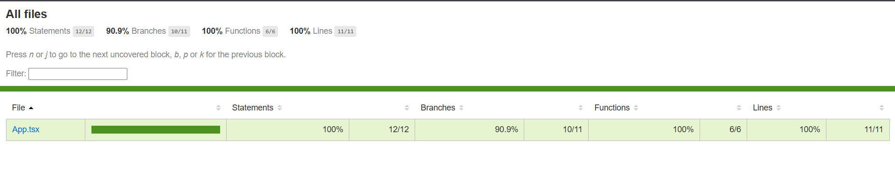
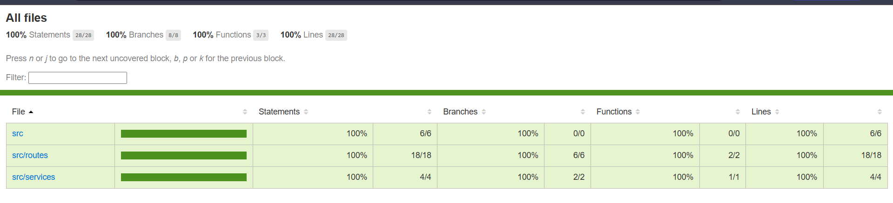

// ...existing code...
# TP7 .1

Resumen rápido
- Backend: TypeScript + Jest (ts-jest). Cobertura: carpeta `server/coverage`.
- Frontend: React + Vitest + Testing Library. Cobertura: carpeta `client/coverage`.

Cómo ejecutar tests (local)
- Server:
  ```powershell
  cd C:\INGSOFT3\ingsoft3\TP6\server
  npm ci
  npm run test        # modo desarrollo
  npm run test:ci     # run + coverage (CI)
  ```
- Client:
  ```powershell
  cd C:\INGSOFT3\ingsoft3\TP6\client
  npm ci
  npm run test        # vitest watch
  npm run test:ci     # run + coverage
  ```

Integración CI
- El pipeline ejecuta `npm run test:ci` en server y client y sube artifacts `coverage`.

Evidencias (capturas)
- Cobertura frontend:
  
- Cobertura backend:
  

Archivos relevantes
- decisiones.md — estrategia y justificación.
- docs/evidencias/ — capturas y archivos adjuntos.