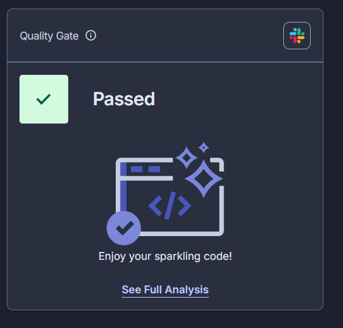
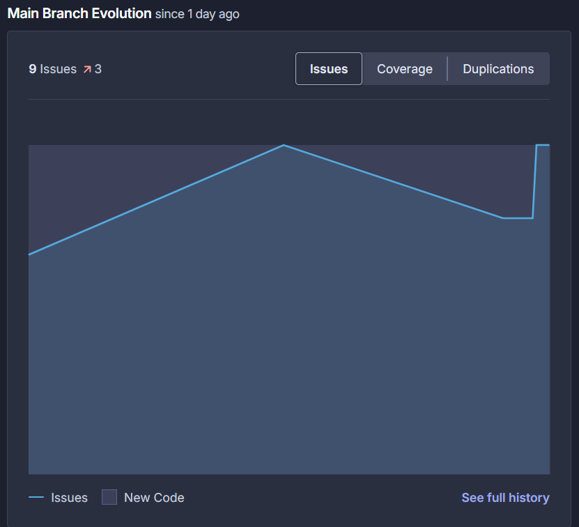
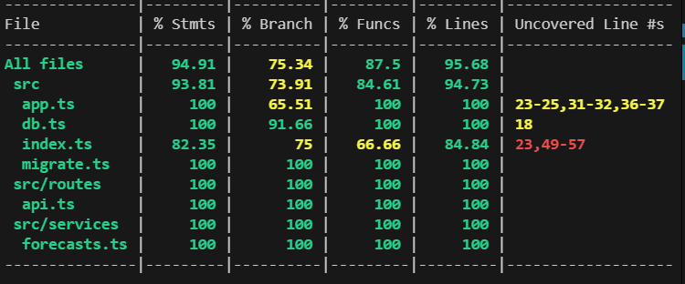
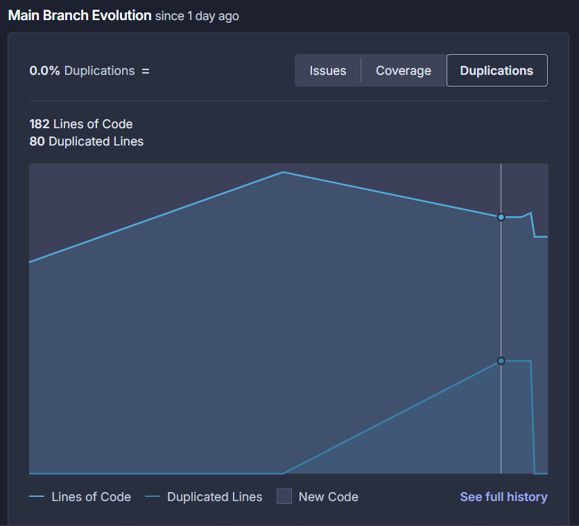
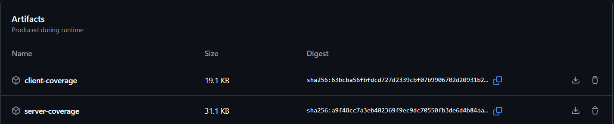
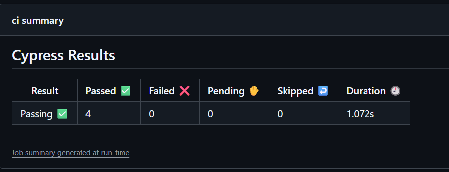
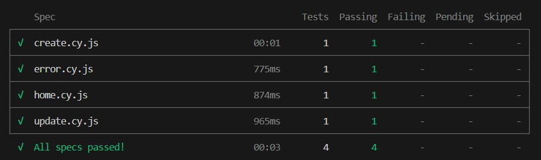
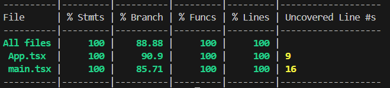

# TP7 - Weather Forecast App

## Quick Links

📋 **Documentación**:
- [decisiones.md](./decisiones.md) - Arquitectura, decisiones técnicas y deployment strategy
- [GCP_SETUP.md](./GCP_SETUP.md) - Guía paso a paso para configurar GCP Cloud Run + Cloud SQL
- [GITHUB_SECRETS_TEMPLATE.md](./GITHUB_SECRETS_TEMPLATE.md) - Template para GitHub Actions secrets
- [infra/terraform/](./infra/terraform/) - Infrastructure as Code (main.tf, qa.tfvars, prod.tfvars)

## Deployment Targets

| Ambiente | Local | QA Cloud | PROD Cloud |
|----------|-------|----------|-----------|
| **Método** | `docker compose up` | Auto CI (push main) | Manual approval |
| **Workflow** | Docker Compose | GitHub Actions | GitHub Actions |
| **DB** | Local Postgres | Cloud SQL | Cloud SQL |
| **Server** | http://localhost:8081 | Cloud Run | Cloud Run |
| **Client** | http://localhost:3000 | Cloud Run | Cloud Run |
| **Guide** | [README.md§7](#7-gestión-de-ambientes-devqaprod) | [GCP_SETUP.md](./GCP_SETUP.md) | [GCP_SETUP.md](./GCP_SETUP.md) |

---

# TP7 - Server — Documentación técnica

Resumen
- Proyecto: TP7 (server + client + database)
- Full-stack weather forecast app con testing, SonarCloud, y Cloud Run deployment
- Evidencias en ./evidencias (capturas de SonarCloud, cobertura y artifacts)

## 1) Justificación tecnológica
Stack elegido:
- Node.js + TypeScript: ejecución rápida, tipado estático para reducir errores y buena integración con Jest/Sonar.
- Express: micro-framework ligero para endpoints REST.
- Jest + Supertest + Vitest + Cypress: pruebas unitarias, integración e2e.
- SonarCloud: análisis estático y Quality Gate para mantener calidad y seguridad.
- PostgreSQL: base de datos relacional con Cloud SQL para PROD.
- Docker + Cloud Run: containerización y deployment serverless en GCP.

Motivos:
- Familiaridad y productividad con TypeScript y Node.
- Ecosistema con herramientas maduras para testing y CI.
- SonarCloud permite mantener políticas de calidad automatizadas.
- Cloud Run = escalabilidad automática sin gestión de K8s.

## 2) Análisis de cobertura — inicial vs final
- Cobertura inicial (antes de ajustes): ≈ 81% (ver evidencia `coverage.png`, `servercoverage.png`).
- Cobertura final (después de correcciones): 94.87% statements, 75.34% branches, 87.5% funcs, 95.65% lines (ver tabla generada por jest en el reporte, evidencia `servercoverage.png`).
- Notas: se trabajó en tests que mockean DB y en aislar módulos para mejorar coverage y fiabilidad de tests.

## 3) Capturas de reportes (evidencias)
- Quality Gate / Sonar: `qualitygate.png`
  
- Issues / Seguridad: `issues.png`
  
- Coverage report (global): `coverage.png`
  
- Coverage servidor: `servercoverage.png`
  
- Duplications: `duplications.png`
  
- Artifacts generados en CI: `artifacts.png`
  
- End-to-end report resumen: `e2eresumen.png` y `e2e.png`
  
  
- Client coverage: `clientcoverage.png`
  

## 4) Casos de prueba de integración implementados
- Endpoint /api/forecasts
  - Respuesta cuando DB devuelve rows (mock success) → 200 y array mapeado.
  - Error en consulta DB (mock reject) → 500 con { error: 'database error' }.
- Endpoint /api/health
  - DB ok → 200 { status: 'ok' }.
  - DB fallo → 500 { status: 'error', error: <msg> }.
- Endpoint /weatherforecast
  - Reutiliza /api/forecasts: respuesta mapeada con campos date, temperatureC, summary.
- Estrategia de tests:
  - Unitarios: funciones en services mockeadas.
  - Integración: Supertest con jest.isolateModulesAsync + jest.doMock para controlar mocks de db antes del require y evitar contaminación entre tests.

## 5) Documentación de la configuración del pipeline
- CI (GitHub Actions / similar) ejecuta:
  1. npm ci
  2. npm run lint (opcional)
  3. npm run test:ci (jest con coverage, --runInBand)
  4. sonar-scanner con variables: SONAR_TOKEN, SONAR_ORG, SONAR_PROJECT_KEY
  5. Generación de artifacts y reportes (adjuntos en evidencia)
- Quality Gate:
  - Rechazo del pipeline si SonarCloud devuelve status ERROR.
  - Condiciones críticas observadas: security_rating y security_hotspots_reviewed (0% revisados) — se debe revisar o arreglar los hotspots en SonarCloud.
- Variables importantes en CI:
  - NODE_ENV=ci
  - PORT (si se usa en tests que lancen servidor)
  - INTERNAL_HOST/INTERNAL_PORT (recomendado para llamadas internas en app)
  - SONAR_TOKEN (secreto)

## 6) Reflexión personal (breve)
- Herramientas como Jest y SonarCloud automatizan la detección temprana de errores y problemas de seguridad.
- Tests aislados (mocks aplicados antes de require) mejoran reproducibilidad y evitan flakiness.
- SonarCloud aporta gobernanza sobre vulnerabilidades y hotspots; marcar hotspots revisados o corregir código elimina falsos positivos y evita bloqueos en CI.
- Recomendación: priorizar fixes de seguridad y reviews de hotspots; usar RNG seguro si datos influyen en seguridad; evitar construir URLs desde datos del cliente.

---

Archivos relevantes:
- Tests: `src/tests/*.ts`
- Servicios: `src/services/forecasts.ts`
- Rutas: `src/routes/api.ts`
- Evidencias: `./evidencias/*` (adjuntas en el repo)

---

## 7) Gestión de Ambientes (DEV, QA, PROD)

### Arquitectura Multi-Ambiente
El proyecto utiliza Docker Compose con configuración parametrizada para soportar tres ambientes:

| Ambiente | Config | Puerto DB | Puerto API | Puerto UI | Uso |
|----------|--------|-----------|-----------|-----------|-----|
| **DEV** | `docker-compose.yml` | 5432 | 8081 | 3000 | Desarrollo local + tests |
| **QA** | `docker-compose.yml` + `.env.qa` | 5432 | 8081 | 3000 | Testing en equipo / CI |
| **PROD** | `docker-compose.prod.yml` + `.env.prod` | 5433 | 8082 | 3001 | Producción remota |

### Uso: DEV (Local)
```bash
# Iniciar ambiente de desarrollo
cd TP7
docker compose up --build -d

# Verificar estado
docker compose ps
docker compose logs -f server

# Detener
docker compose down
```

El `.env` de DEV usa las variables por defecto (miPass, puerto 5432, etc.).

### Uso: QA (Testing)
```bash
# Copiar configuración QA
cp .env.qa .env

# Iniciar con env QA (mismo que DEV pero con variables explícitas)
docker compose up --build -d

# Testing
npm run test:ci
npx cypress run
```

### Uso: PROD (Producción)
```bash
# Copiar configuración PROD y actualizar secretos
cp .env.prod .env
# ⚠️ IMPORTANTE: Actualizar en .env:
#   - DB_PASSWORD con contraseña segura
#   - WEATHERAPI_KEY con clave PROD
#   - CLIENT_HOST con dominio real
#   - CLIENT_URL con URL PROD

# Iniciar con compose PROD (puertos y volúmenes diferentes)
docker compose -f docker-compose.prod.yml up --build -d

# Verificar health
curl http://localhost:8082/health
```

### Configuración por Ambiente

**Variables clave** (ver `.env.qa` y `.env.prod`):
- `DB_USER` / `DB_PASSWORD`: Credenciales PostgreSQL
- `DB_NAME`: Base de datos (tp7_db, tp7_qa_db, tp7_prod_db)
- `NODE_ENV`: development, staging, production
- `WEATHERAPI_KEY`: API key de Weather API (diferente por env)
- `CLIENT_URL`: URL del cliente (http://localhost vs https://prod.domain)
- `FORECAST_COUNT`: Cantidad de forecast (5 dev, 10 prod)

### Volúmenes y Persistencia

- **DEV**: `db-data` (volumen anónimo, se limpia con `docker compose down --volumes`)
- **PROD**: `db-prod-data` (bind mount a `./data/prod-db`, persiste entre reinicios)

### Health Checks
- **DB**: `pg_isready` cada 5 segundos
- **Server**: `/health` endpoint cada 10 segundos (PROD)
- **Client**: Verifica que port 8080 responda (implicit via depends_on)

### Cleanup & Reset
```bash
# Limpar DEV (elimina datos)
docker compose down --volumes
docker compose up --build -d

# Limpar PROD (preserva volumen)
docker compose -f docker-compose.prod.yml down
docker compose -f docker-compose.prod.yml up -d
```

---

Fin del documento.